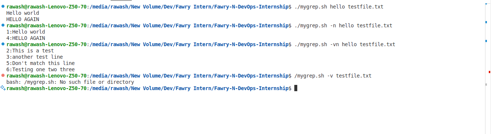

# Fawry-N-DevOps-Internship

## Project Description
This repository contains resources and projects related to the Fawry N DevOps Internship program. It includes hands-on exercises, scripts, and documentation to help participants learn and apply DevOps practices.

## Prerequisites
- Basic knowledge of DevOps concepts.
- Installed tools: Git, Docker, Kubernetes, and any other required tools as specified in the exercises.

## Installation
1. Clone the repository:
   ```bash
   git clone https://github.com/your-username/Fawry-N-DevOps-Internship.git
   ```
2. Navigate to the project directory:
   ```bash
   cd Fawry-N-DevOps-Internship
   ```

## Usage
Follow the instructions in the respective folders to complete the exercises. Each folder contains a README file with detailed steps for the tasks.

### Running the Script
To run the script, use the following command:
```bash
./mygrep.sh -n <pattern> <file>
```

### Options
- `-v`: Invert match (show lines that do not match the pattern).
- `--help`: Display the help message.

## 🧠 Reflective Section

In your submission, include:

1. **A breakdown of how your script handles arguments and options**  
   The script uses the `getopts` command to parse options (`-v`, `-n`, and `--help`). Each option sets a corresponding boolean variable (`invert_match`, `show_line_numbers`) to control the script's behavior. After parsing options, the script shifts the positional arguments to access the `pattern` and `file` inputs.

2. **A short paragraph: If you were to support regex or `-i`/`-c`/`-l` options, how would your structure change?**  
   To support regex, the script would need to use tools like `grep` or `awk` internally or implement regex matching using `bash`'s `[[ =~ ]]` operator. Adding `-i` (ignore case) would require converting both the pattern and lines to lowercase before comparison. For `-c` (count matches), a counter variable would be incremented for each match and printed at the end. For `-l` (list matching files), the script would exit after printing the filename of the first match.

3. **What part of the script was hardest to implement and why?**  
   The hardest part was implementing the `-v` (invert match) option because it required careful handling of boolean logic to ensure that matches were correctly inverted without affecting other options.

## Screenshot of the running code 

  

## Answers to Questions

1. **How does the script handle arguments and options?**  
   It uses getopts for short options and manual checks for long options. Boolean variables guide the behavior after parsing

2. **How would you adapt the script for regex, -i, -c, and -l?**  
   Use Bash’s [[ =~ ]], convert text for case-insensitivity, use counters for counting, and exit after the first match for listing.

3. **What was the hardest part and why?**  
   Implementing -v (invert match) was challenging because it needed very clean and careful boolean logic to work correctly alongside other options.